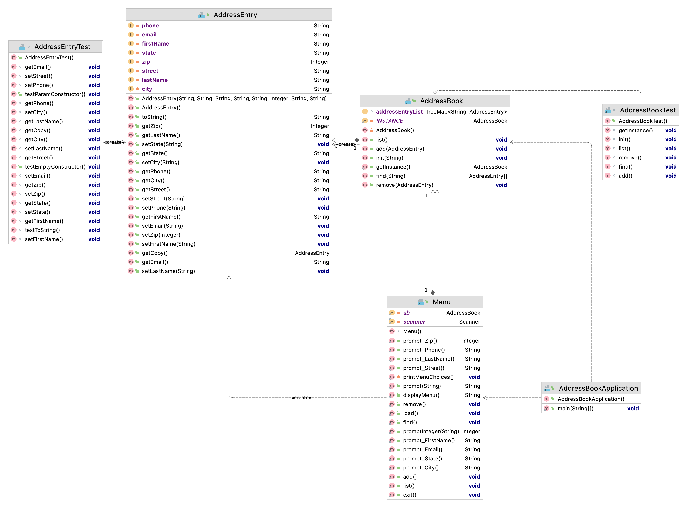
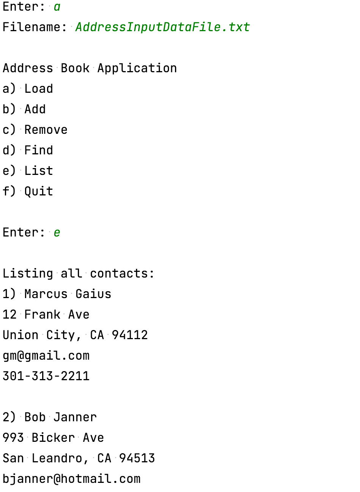
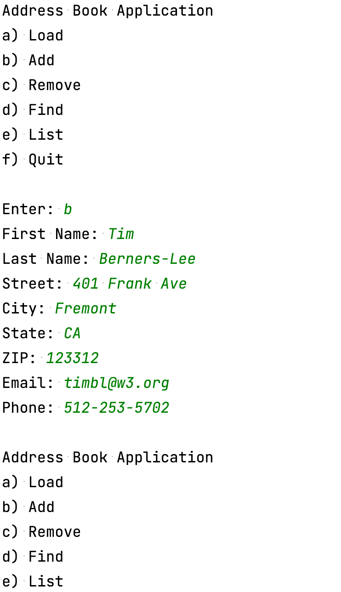
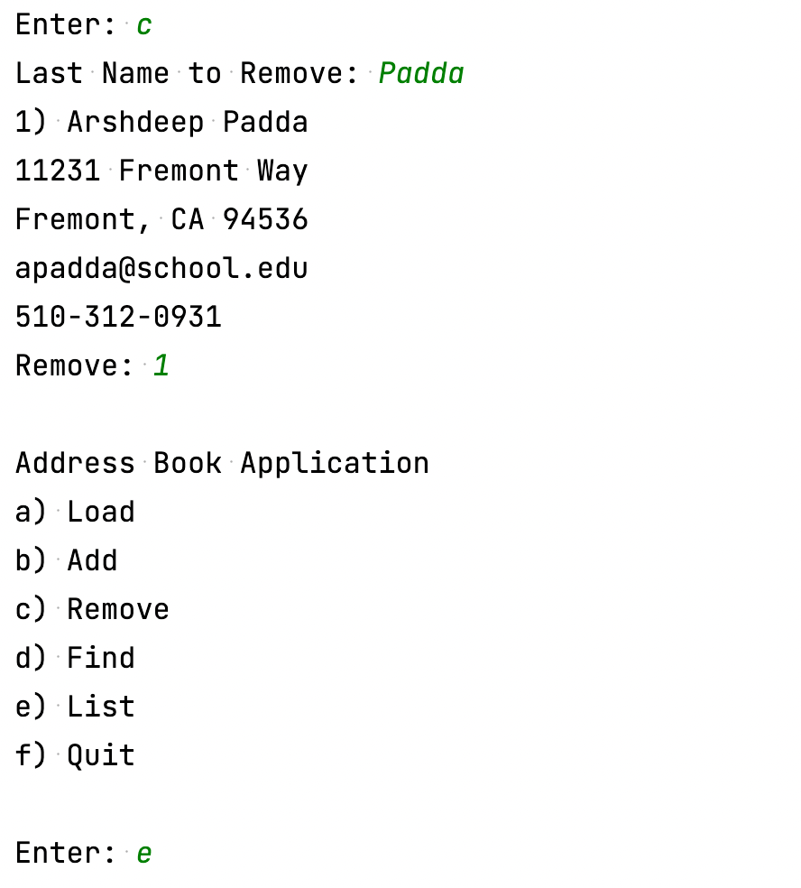
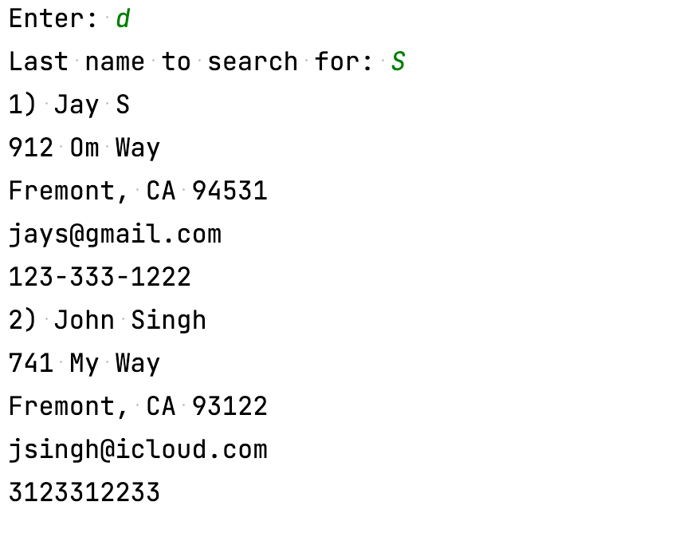
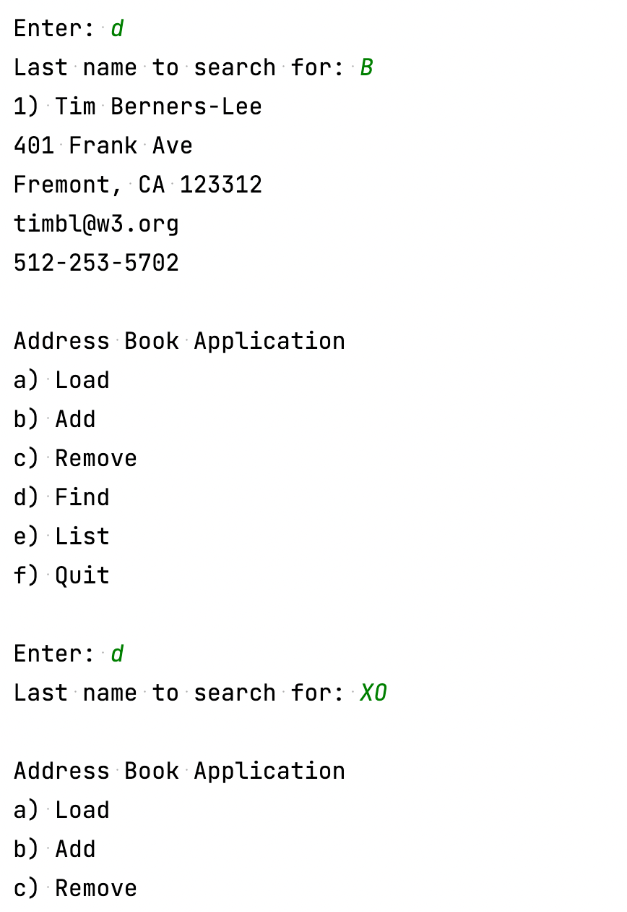
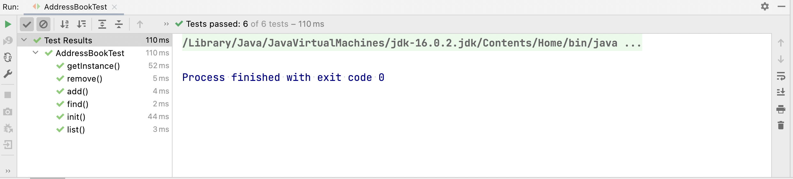
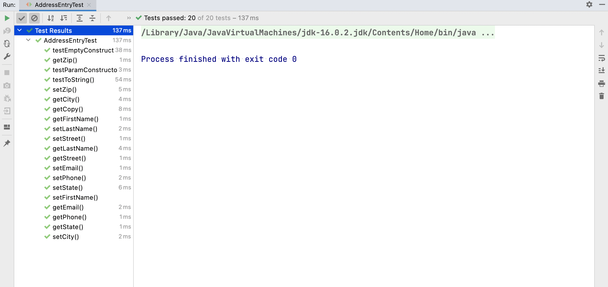

# Section A: Description

## A1 State of System

All systems functional, namely:

- `Menu`
- `AddressEntry`
- `AddressBook`
- `AddressBookApplication`

## A2 List of Classes

### Address Entry

- Provides representation of a contact entity, with fiels such as:
  - First name
  - Last name
  - Street address
  - City
  - State
  - ZIP
  - Email
  - Phone
- Provides getters and setters for data access and mutation
- Since this is a data encapsulation class,
  there is no notable complexity to discuss.

### AddressBook

- Singleton model, singular instance throughout application
- Maintains a contact store.
  `TreeMap` is used as implementation for this store.
- Allows listing, searching, adding, and removing of contacts.
- Listing:
  - O(n) each item in store is printed to screen.
- Searching:
  - Subtree construction is near O(1)
  - Function itself is O(m) where m is the number of
  matching contacts to query, as each of these AddressEntry
  objects is filtered and copied to an array before return.
- Adding
  - Adding is O(logn)
- Removing
  - Removing is O(logn)

### Menu

- Handles prompting user for input
- Facilitates user choice handlers, e.g. `list`,
  `add`, `find`, etc.
  - These functions are operate by making the
  appropriate call to `AddressBook.add`, etc.

### AddressBookApplication

- Grabs a handle on `AddressBook` and starts a
  program loop, prompting user for menu choice
  and firing off the respective choice handler in `Menu`

### Testing

- Finally, there is class unit testing for classes such as
  `AddressBook` and `AddressEntry`.

# Section B: JavaDoc

Docs viewable [here](./docs/index.html).

# Section C: UML Design

# Section D: Screen Shots

## D1

## D2

## D3

## D4

# Section E: Commit History

Screenshot may be missing some final commits.

# Section F: Project Demonstration

See YouTube video [here](https://youtu.be/yDPqay_EmRM).

# Extra: Tests

